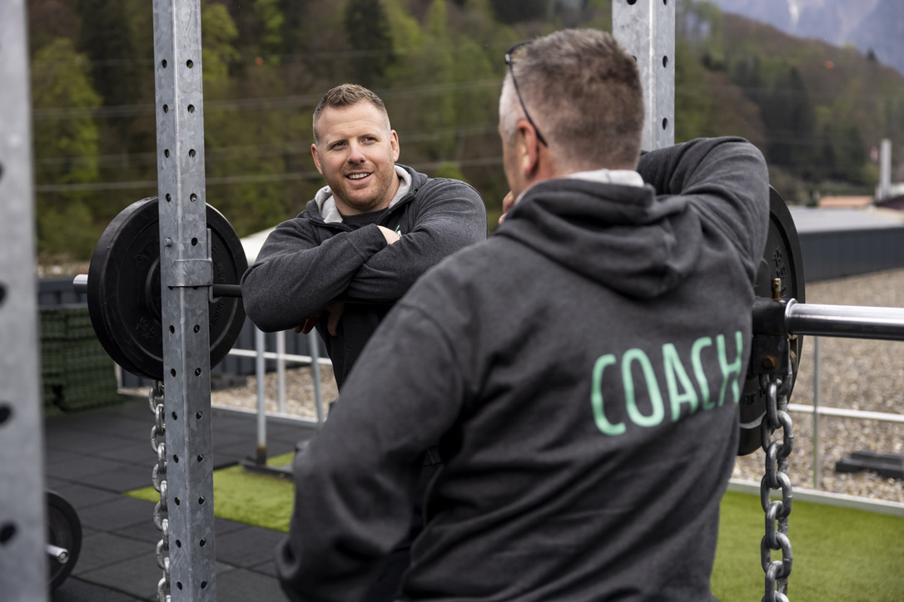

+++
title = "Der König der Schweiz"
date = "2023-04-07"
draft = false
pinned = false
tags = ["Reportage", "Spitzensport"]
image = "m-g-cpop.jpg"
description = "Matthias Glarner ist ein berühmter Schweizer Athlet und ein ehemaliger König der Schweiz."
+++
Eines unglücklichen Tages bei einem Termin mit der Schweizer Illustrierten kommt es zu einem Unfall, der das Leben von Matthias Glarner prägnant verändert. Diese Tragödie erfordert viel Geduld, Kraft und grosse Mühen.

**Unverhofft kommt oft. Der lange und schwere Weg vom Unglück über die Heilung und den Wiederaufbau bis hin zur persönlichen Unterstützung und die Zukunft nach dem Spitzensport.**

Wir sitzen dem ehemaligen Schwingerkönig Matthias Glarner in Magglingen in einem kleinen Besprächungszimmer gegenüber. Er ist gut gelaunt und sichtlich locker, obschon er gleich ein Interview zu seinen doch bewegenden und verändernden Verletzungen gibt.

### Der Sport und das Unglück

Für Matthias Glarner sind Interviews und Fotoshootings fester Bestandteil seiner Agenda. Solche Fotoshootings sollen hauptsächlich als Werbung und Vermarktung der jeweiligen Sponsoren dienen, aber auch, um seine Popularität zu fördern. Dieses eine Fotoshooting für die Schweizer Illustrierte ist für Matthias Glarner verhängnisvoll.

Im Juni 2017 zwischen 7.00 – 7.30 Uhr ist der Schwingerkönig am Hasliberg, noch bevor die Gondelbahn offiziell öffnet. Die Schweizer Illustrierte ist ebenfalls bereits vor Ort. Anschliessend starten sie mit dem Fotoshooting. Er steigt auf eine Gondel hinauf, um aus dieser Perspektive fotografiert zu werden. Alles scheint reibungslos zu funktionieren. Doch dann riss unerwartet seine Sicherungsleine und er ist 12 Meter auf den Boden gefallen. Der Absturz von der Gondel ereignet sich ca. um 8.00 – 8.30 Uhr.

### Aufgeben ist keine Option

Die Rega fliegt ihn rasch nach Bern ins Inselspital. Dort muss sich Matthias Glarner einem «MRI», also einem Röntgen, unterziehen. Dabei kommt heraus, dass Glarner eine Fussfraktur, mehrere Bänderrisse innerhalb des Fusses, ein aufgesprengtes Becken, Innen- und Kreuzbandrisse, Schirmblechblutungen und zwei gebrochene Finger hat. Daraufhin wird er erstmal zwei bis acht Stunden operiert.

> Zuerst dachte ich, es ist gar nicht so schlimm und man kann es operieren. Am Anfang waren es eigentlich positive Gedanken gewesen.

Für Matthias Glarner ist es zunächst ein Aufwachen und Realisieren der Lage. Der Arzt hat ihm schnell gesagt, diese Saison ist vorbei. Aber an das Karrierende denkt Matthias Glarner noch überhaupt nicht, sagt er mit grosser Entschlossenheit.

### Heilung und Wiederaufbau

Die Liste gebrochener Köperteile ist lang. Nach den Operationen kommt die Reha, also eine Wiederaufbauphase. Die Grundheilung dauert 2-3 Jahre, bis jede Verletzung richtig verheilt und ausgeheilt ist, dauert es ca. 4-5 Jahre. Obschon das Becken am sichersten eingebunden ist, ist es zu einem grossen Handicap geworden. Nicht mehr als einen 90° Winkel darf er mit seinem gebrochenen Becken machen, so Glarner.

Die Operationen hinter sich lassend, trainiert Glarner wieder weiter und bereitet sich auf die kommende Saison vor. Das tägliche Training ist jeden Tag eine grosse Herausforderung. Manchmal gibt es Fortschritte, dann aber auch wieder Tage, an denen es ihn zurückwirft. Glarner muss bei jedem Training mit dem «Fiebermesser» schauen, was geht und was noch nicht geht, verdeutlicht er mit passender Gestik.

> «Es ist schon eine Mammutaufgabe».

Schlussendlich hat er mit der Titelverteidigung ein klares Ziel. Nach seinem Rücktritt hat er sich psychisch und physisch «leer» gefühlt. In Zeiten von Rückschlägen und mentalen Tiefs holt sich Glarner Kraft von seinem Umfeld. Ebenso wichtig für den mentalen Aufbau ist die Unterstützung eines Sportpsychologen.

> «Durch die psychologische Unterstützung habe ich alles gut verarbeitet und ich trage heute keinerlei offene Wunden mit mir herum».

### Sponsoren Unterstützen

Seine Sponsoren haben sehr grosse Geduld in Bezug auf die Verletzung gezeigt. Sogar noch ein neuer Sponsor ist in dieser Zeit dazu gekommen. Ausserdem stehen sie nicht nur schüchtern am Rande, sondern helfen auch aktiv beim Aufbau mit.

> «Dies ist ein natürlicher Prozess».

Nach dem Rücktritt haben die meisten Sponsoren ihren Vertrag mit Glarner beendet. Jedoch sind nicht ganz alle gegangen. Er arbeitet heute noch mit verbleibenden Sponsoren zusammen.

### Die Zukunft nach dem Spitzensport

Heute engagiert sich Matthias Glarner unter anderem als Trainer in der Spitzensportrekrutenschule in Magglingen. Dort betreut er Schwinger, die den WK (zu absolvierende Diensttage in der Armee) durchlaufen. Zudem hat Glarner ein eigenes Projekt, in dem er zu zweit 30 Sportler und Sportlerinnen in unterschiedlichsten Sportarten, unterstützt. Des Weiteren ist Glarner als Funktionär im Bewerbungs - OK für das Eidgenössische Schwingfest in Thun tätig. Der Schwingsport wird ihn sicher noch die nächsten 10 Jahre beruflich begleiten.

Sein Sportstudium ist ihm sowohl früher als auch heute noch von grosser Hilfe. Sport ist schon immer ein wichtiger Teil von Glarners Leben gewesen. Deshalb hat er auch Sport studieren wollen. Nicht nur, damit er eine Ausbildung hat, sodass er auch nach dem Spitzensport einer Beschäftigung nachgehen kann , beendet er mit glücklicher Mimik den Satz.

> Ich bin absolut zufrieden, wie es gekommen war. Alles gut.



Verletzungen im Spitzensport sind ein häufiges Problem in der Schweiz. Laut einer Studie des Bundesamts für Sport (BASPO) aus dem Jahr 2018 erlitten rund 39 Prozent der Athletinnen und Athleten im Spitzensport in den letzten 12 Monaten mindestens eine Verletzung. Die häufigsten Verletzungen betrafen dabei die unteren Extremitäten, wie beispielsweise Knie, Sprunggelenke und Hüften.

Eine weitere Studie des BASPO aus dem Jahr 2017 zeigt, dass Verletzungen im Spitzensport nicht nur für die Athletinnen und Athleten selbst ein Problem darstellen, sondern auch für das Gesundheitssystem und die Wirtschaft der Schweiz. Die Kosten für die Behandlung von Sportverletzungen werden auf rund 700 Millionen Franken pro Jahr geschätzt.

Es liegen keine konkreten Zahlen darüber vor, wie viele Schweizer Spitzenschwinger aufgrund von Verletzungen oder Unfällen ihre Karriere beenden müssen. Es gibt jedoch zahlreiche Beispiele von Schwinger-Athleten, die aufgrund von Verletzungen oder langfristigen Schäden ihre Karriere vorzeitig beenden mussten.

Die Schwinger haben auch ein eigenes Versicherungssystem, welches die Kosten für Unfälle und Verletzungen im Training und Wettkampf abdeckt. Wenn ein Schwinger jedoch aufgrund einer Verletzung oder Unfall dauerhaft ausfällt, kann dies für ihn oder sie eine grosse finanzielle und persönliche Herausforderung darstellen.

