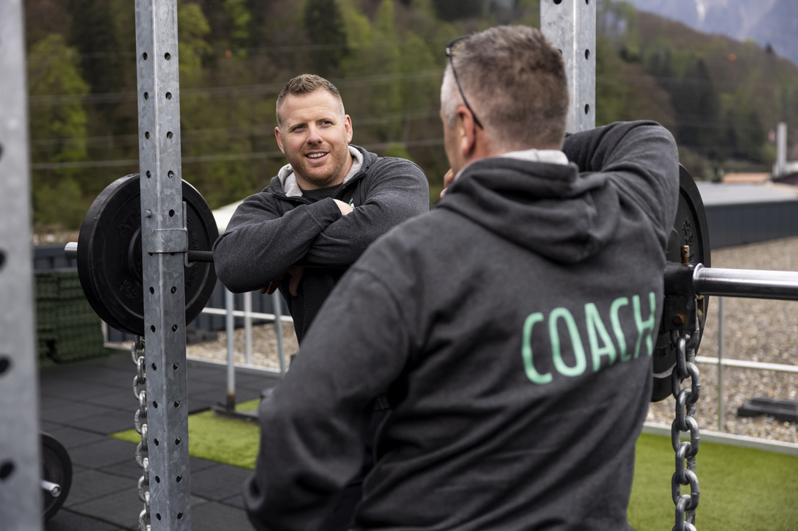
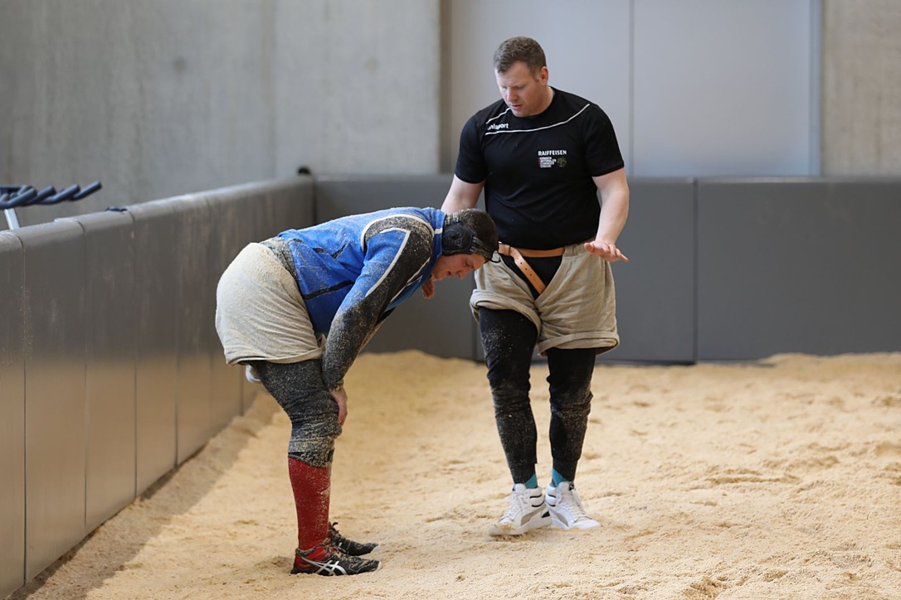

+++
title = "Matthias Glarner"
date = "2023-03-17"
draft = false
pinned = false
image = "m-g-cpop.jpg"
description = "Matthias Glarner ist ein berühmter Schweizer Athlet und ein ehemaliger König der Schweiz."
+++

### Was genau ist am Tag des Unfalls passiert?

Juni, 2017 gab es ein Fotoshooting für die Schweizer Illustrierte. Dabei wollten sie einen Spitzenschwinger bei der Arbeit begleiten. Zwischen 7.00 - 7.30 Uhr war Matthias beim Hasliberg, bevor die Bahn offiziell offen hatte. Vor dem Betrieb der Bahn, stieg er auf die Gondel und fuhr Richtung Tal. Danach stand er auf die Gondel drauf und das Fotoshooting, vom Boden aus, begann. Anschliessend verhedderte sich das Sicherungsseil seines Klettergurtes in der Stüzte. 

> Dies riss es mich vom Gondeldach, meine Sicherungsleine riss ab und ich flog 12 Meter auf den Boden.

Dies ereignete sich ca. Um 8.0- 8.30 Uhr. Nach dem Shooting.

### Wie ging es weiter?

Die Rega kam ziemlich rasch und flog ihn in die Insel. Danach gab es ein MRI. Darin sah man eine Fussfraktur und mehrere Bänderisse im Fuss, das Becken war aufgesprengt, es gab Innenband- und Kreuzbandriss Schirmblechblutungen rechts plus zwei gebrochene Finger. Nach dem MRI ging es noch etwa zwei Stunden bis er acht Stunden lang operiert wurde. Zuerst das Becken operiert, Hand und Fuss parallel operiert.Fertig war er am Abend um 22.00 Uhr.

### Was waren seine ersten Gedanken als er die Situation im Überblick hattest?

> Zuerst dachte ich es ist gar nicht so schlimm und man kann es operieren. Am Anfang waren es eigentlich positive Gedanken gewesen.

### Was hat ihm der Arzt gesagt, als er herein kam?

Matthias hat gefragt, ob es realistisch ist diese Season noch zu schwingen? Die Ärzte sagten daraufhin ziemlich schnell nein. Er wusste schon vor der Operation, dass es diese Season vorbei ist. 

### Wie lange brauchte die Verheilung?

> Alles was Herznahe ist, verheilt besser. 

Im Becken haben sie ihm eine Platter hinein operiert. Die Heilung dauerte 2-3 Jahre. Er musste den Fuss noch ein 2. Mal operieren und danach Reha absolvieren und merkte, dass es noch nicht wie vorher war. Man muss ca. zwischen 4-5 Jahren rechnen, bis alles wieder richtig gut ist.

### Inwiefern hat ihn das Becken Privat dann eingeschrenkt?

Er durfte nicht mehr als einen 90° Winkel machen. Das Becken war sehr anstrengend, aber war von Anfang an gut. Das mühsamste war der Fuss.

### Gab es noch Aussichten zum Spitzensport zurückzukehren?

Er hatte noch grosse Chancen zurück zu kehren. Am Eidgenössischen 2019 hat er wieder geschwungen. Man muss Physiotherapie, pflegen, speziell Wärmen, spezial Schuhe, entzündungshemmende Tabletten und spezielle Ergänzungsnahrung zu sich nehmen. Dies war ein ständiger Begleiter.

### Wie lange dauert die Aufbauphase?

Zum ersten Mal ging die Reha 2 Monate, nach der 2. Fussoperation waren es fast 3 Monate Reha. Es ging beinahe ein Jahr, bis er wieder ein bisschen schwingen konnte.

### Hat es ihn auch zurückgeworfen?

> Mich hat es jeden Tag ein wenig zurückgeworfen. Ich musste quasi jeden Tag mit dem Fiebermesser schauen, was geht und was nicht. 

### Wie hat Matthias Glarner mental beeinflusst, wenn er weiss, dass der Weg zurück lange und schwierig ist?

Es war schon eine Mammutaufgabe. Gesund sein ist mental immer einfach. Es gab schon auch Momente, in denen er gesagt hat “das bringt doch nichts”. Schlussendlich hat er aber dieses Ziel zurückzukommen. Am Ende merkt er, wie “leer” er nach seinem Rücktritt war (physisch und psychisch).  

### Was unterstützt ihn in mentalen Krisen? Wo hat er Kraft getankt?

> Einerseits hat mich das Ziel weitergetrieben, da ich noch Schwingerkönig war und den Titel verteidigen wollte. Und andererseits braucht es ein gutes Umfeld. Dazu kommt noch ein guter Reha plan. 

### Haben seinen Sponsoren auch Geduld gehabt, diese Hürde auf sich zu nehmen und das mit ihm auszuprobieren?

Seine Sponsoren haben ihm sehr grosszügige Unterstützung gegeben. Und es kam in dieser Zeit sogar noch einen Sponsor dazu, der ebenfalls beim Aufbau mithelfen wollte.

### Hat er diese Sponsoren heute noch oder nicht?

Das ist eine Art natürlicher Prozess. Einen Teil der Sponsoren sind noch heute dabei und die anderen sagten, dass mit dem Karriereende auch das Engagement endet. Einige von ihnen sind aber geblieben. Also eine ganz coole Sache.

### Welche Berührungspunkte mit dem Schwingsport hat er jetzt noch?

Er ist als Trainer in einer Spitzensportrekrutenschule in Maggligen engagiert. Dort sind 2 Spitzenschwinger, welche die RS machen und 25 Schwinger, wie den WK absolvieren. Dazu kommt noch ein eigenes Projekt. In diesem Projekt betreut er zu zweit 30 Sportler/-innen. Hauptsächlich betreut er Schwinger, aber unter diesen 30 Personen ist es Querbeet an Sportarten. Dementsprechend hat er jeden Tag noch mit dem Sägemehl Kontakt.

> \-Sie stehen aber selbst nicht mehr auf dem Sägemehlring?   
> -Ich stehe nur noch mit der Stoppuhr auf dem Sägemehl. Nur noch Trainerarbeit. 

### Welche Zukunftsaussichten hat er? 

Zum einen als Trainer und zum anderen ist er noch im Bewerbungs OK  für das Eidgenössische Schwingfest in Thun als Funktionär. Des weiteren arbeit er noch ein wenig mit Sponsoren. Der Schwingsport wird ihn die nächsten 5 bis 10 Jahre noch intensiv begleiten.  

### Sieht er sich auch als Sportmoderator zum Beispiel beim SRF? 

Beim letzten Eidgenössischen war er absichtlich nicht mit dabei, weil es sein erstes Eidgenössisches als Zuschauer war.

> Bis jetzt ist noch keine Anfrage gekommen. Wie es beim nächsten Eidgenössischen sein wird, werden wir sehen....  

### Wie, beruflich gesehen, nützt ihm sein Sportstudium etwas? 

Dieses Studium ist breit gefächert und ging bei ihm in Richtung Sport und Leistung, was für ihn als Trainer nun einen Nutzen hat. Auch für das Verständis seiner Verletzungen, war das Studium hilfreich. 

### Es gibt Sportler, die sich einen Beruf aneignen, damit sie für nach dem Sport etwas in der Hand haben. War das bei ihm auch der Fall?  

Ja und nein. Einerseits ja, damit er auch nach dem Spitzensport einen Ausgangspunkt hat und andererseits wollte er sich mit Sport befassen und sein Leben mit Sport verbringen. Es war eine win-win Situation gewesen. 

### Käme es infrage Sport in einem Schulzimmer zu unterrichten? 

Das hat er 4 Jahre lang gemacht in einer Gewerbsschule in Interlaken. Sag niemals nie, aber im Moment ist es gut so wie es ist. Auch ein Unterschied ist, dass es bei Schüler/-innen manchmal etwas an Motivation fehlt. Bei den Sportler/-innen ist dies anders. Sie kommen und wollen 120% von ihm. 

### Welche “Beziehung” hat er zu seinen Sportler/-innen? Mentor oder einfach Trainer? 

> Das ist sehr unterschiedlich. In erster Linie bin ich Athlektiktrainer im Bereich Kraft und Ausdauer.

Er ist ein Berater für Tipps für technische oder taktische Fragen, wenn Schwinger zu ihm kommen. Wenn sie aber ein spezielleres Anliegen haben, schickt er sie zu Spezialisten, die er im Umfeld hatte.

### Wurde er von Magglingen angefragt? 

Er war während seiner Zeit als Schwinger bereits in Magglingen aktiv gewesen und hat das dann laufend organisiert. Nach seinem Rücktritt braucht er 2 Jahre Ruhe und Abstand von allem. Danach hat er ein Telefonat geführt und beide Seiten fanden es optimal, wenn er als Trainer in Magglingen arbeiten würde. So hat es sich ergeben. 

### Hätte sich dieser Unfall so nicht ereignet, hätte er sich diesen beruflichen Werdegang auch so vorstellen können?  

> Ich war schon vor meinem Unfall nicht mehr am Höhepunkt meiner Karriere gestanden. 

Er setzt sich sowieso damit auseinander, wie es weiter gehen soll. Also war der Unfall nicht der Auslöser gewesen. Dieser Weg wäre so oder so ähnlich abgelaufen. 

### Hat er sich aber schon vorher gleich stark mit diesem Thema befasst oder hat er es einfach mal laufen lassen? 

Seine Planung ging bis Ende August 2019 Viel weiter hat er gar nicht überlegt. Er hat aber auch eine Sicherheit durch sein Sportstudium gehabt. Finanziell gesehen, konnte er ihm auch ein halbes Jahr Zeit nehmen, um über das weitere Vorgehen nachzudenken. Er fand das ein guter Abschluss.

### Brauchte es Verarbeitungszeit, bis er so gut über die Geschehnisse, wie jetzt, sprechen konnte? 

Er braucht schon Verarbeitungszeit. Die Bilder hat er heute noch im Kopf. Es ist ein Teil seines Lebens. Aber er konnte alles sehr gut verarbeiten. Ihm ist ein Psychologe beigestanden. 

### Wie hätte er sich sein Karriereende vorgestellt, wenn er ihm eines hätte ausmalen können?  

Rückblickend ist es für ihn total stimmig, wie es war. Für ihn als Sportler ist es das Wichtigste, wenn er auswählen kann, will er noch oder nicht mehr. Und das konnte er, wenn auch in einem kleineren Mass. 

> Ich bin absolut zufrieden, wie es gekommen war. Alles gut. 

### Machen ihm seine Verletzungen heute noch medizinische Beschwerden? 

Absolut null. Er kann Skifahren, Schwingen und in den Kraftraum gehen. Der Fuss bereitet manchmal etwas Mühe, dann nemmt er den Tag etwas lockerer. 

### Wie kam er zum Schwingen? 

Familientradition. So bin ich in den Schwingkeller gekommen. 

> Ich würde allen Kindern empfehlen, sich zu bewegen und Spass haben am Sport. 

### Von welchem Punkt an, im Schwingen, ist es nicht mehr nur einfach Sport, sondern Spitzensport? 

Mit 15,16 Jahren kommen grosse Fragen auf einem zu. Was will man für eine Schule besuchen oder Lehre? Oder welchen Sport will man als Hauptsport betreiben? Er hat sich für den Schwingsport entschieden. Mit Dann wächst alles miteinander zusammen. Irgendwann war er in einem Kader und dann ging es immer weiter nach oben. 

### Ist es im Schwingsport schwer an Sponsoren zu kommen? 

Die besten haben fast alles und der Rest hat fast keine Sponsoren. Bei ihm war es so, dass mit steigender Leistung auch die Sponsoren zunahmen. Ab dem Königstitel kamen die Sponsoren von sich aus. 

### Ist Matthias Glarner zufrieden mit dem wie es jetzt ist?

> Ich bin sehr happy! Ich bin total im Reinen mit der Vergangenheit.

Er findet , es ist ein Privileg, mit den besten aus diesem Sport, zusammen zu arbeiten und freue ihm extrem, auf das, was kommt.