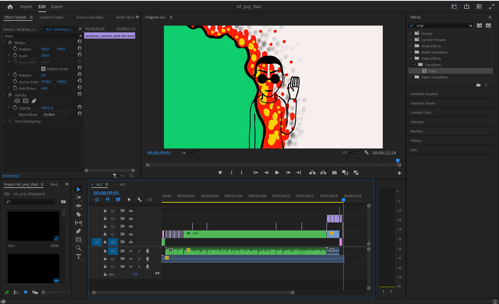

+++
title = "Photoshop Beta Ai"
date = "2023-06-11"
draft = false
pinned = false
+++
Photoshop nutzt zunehmend Künstliche Intelligenz, um das Leben von Fotografen und Designern einfacher zu machen. Von automatischen Filter zur Bildoptimierung bis hin zu Werkzeugen, die kreative Workflows beschleunigen, bringt die Implementierung von KI in Photoshop viele Vorteile mit sich.

Neue Filter wie "Content-Aware Fill" und "Object Selection" nutzen maschinelles Lernen, um Objekte in Bildern intelligent zu erkennen und auszuwählen. So können Ablenkungen automatisch entfernt und Bildbereiche ausgefüllt werden, ohne mühsam mit dem Zauberstab zu arbeiten.

Weitere Beispiele sind der "Styleguide Match" zur Anpassung von Textformaten an ein vordefiniertes Design und der "Scene-Selective Color" Filter zur gezielten Farbanpassung in verschiedenen Bildbereichen. All diese Tools nutzen KI, um kreative Prozesse zu beschleunigen.

Die Beta-Version von "Adobe Sensei" bringt diese KI-Fähigkeiten in Photoshop auf die nächste Stufe. Mit Techniken wie maschinellem Lernen, Deep Learning und neuronalen Netzen werden Filtersätze und Werkzeuge intelligenter und genauer.

Obwohl KI Photoshop noch nicht vollständig automatisieren kann, bedeutet jeder Fortschritt eine enorme Zeitersparnis für kreative Arbeit. Daher setzt Adobe zunehmend auf KI und maschinelles Lernen, um Photoshop zu verbessern.

Die Integration von Künstlicher Intelligenz in Photoshop hat das Potenzial, die Produktivität von Fotografen und Designern deutlich zu steigern. Je intelligenter die Tools werden, desto mehr Zeit bleibt für kreative Aufgaben.



[Film Burn Transition Stock Video Footage for Free Download (vecteezy.com)](https://www.vecteezy.com/free-videos/film-burn-transition?page=2)

[Sage - Poe](https://poe.com/)

[Voice Generator (Online & Free) 🗣️](https://voicegenerator.io/)

[Adobe Photoshop | Bildbearbeitung und Design-Software](https://www.adobe.com/ch_de/products/photoshop.html)

[Videoschnitt & Bearbeitung | Adobe Premiere Pro](https://www.adobe.com/ch_de/products/premiere.html)

