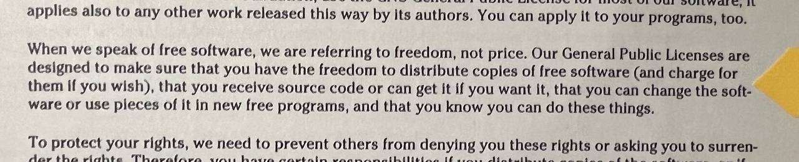

+++
title = "Warum ist Blender das beste Instrument für 3D-Modellierung?"
date = "2024-03-04"
draft = false
pinned = false
image = "r.png"
+++

          In diesem Text werde ich erörtern, warum sagt man, dass Blender das beste Werkzeug für 3D-Modellierung ist. Dieses Thema hat mit meine MA zu tun, denn in meine MA werde ich dieses Werkzeug verwenden, um 3D-Animationen zu erstellen und in den Praxis werde ich prüfen, ob es wirklich ein gutes Werkzeug für dies Aufgabe ist.

          Zum Beginn möchte ich erklären was ist eigentlich Blender. Laut Brooks wird , dass Blender die kostenlose und quelloffene 3D-Kreativ-Suite ist. Es unterstützt den gesamten 3D-Pipeline-Prozess, einschließlich Modellierung, Rigging, Animation, Simulation, Rendering, Compositing und Motion Tracking, Video-Bearbeitung sowie 2D-Animations-Pipeline.[(](#_ftn1)Brooks, Katelyn (2020): Beginner’s Guide to Blender. Abgerufen am Frühling 2020 von (Beginners-Guide-to-Blender.pdf (studentcabletelevision.com)[)](#_ftn1) Welche Ziele es verfolgt. Es gibt drei Hauptziele: Erstens ermöglicht es talentierten Blender-Künstlern, ihre besten Werke in einem gut unterstützten professionellen Umfeld mit größtmöglicher Freiheit zu schaffen. Zweitens wird Blender selbst verbessert, indem intensives und hochwertiges Nutzerfeedback, Fehlerberichte und finanzielle Unterstützung für Entwickler bereitgestellt werden. Drittens werden hochwertige offene Inhalte produziert, um die technischen Fähigkeiten von Blender zu präsentieren und als Lernmaterial für die Blender-Benutzergemeinschaft zu dienen.(Mullen, Tony Jason (2 2011): Introducing character animation with Blender, second edition. Indiana: Wiley Publisching, Inc)\[Mullen 2 2011, S.350]

\    Blender nimmt eine einzigartige Position in der Welt der 3D-Computergrafik ein. Früher gab es nur wenige Möglichkeiten, sich mit 3D-Modellierung und Animation zu beschäftigen, und die meisten davon waren entweder zu teuer, zu begrenzt oder - nun ja - zu illegal für Menschen, die einfach nur herausfinden wollten, worum es bei diesem ganzen 3D-Ding geht. Blender umgeht all diese Probleme, denn es ist kostenlos. Eine große Gemeinschaft von Entwicklern und Nutzern trägt kontinuierlich dazu bei und erweitert es in atemberaubendem Tempo mit Verbesserungen und Erweiterungen. (van Gumster, Jason (2 2011): Blender for dummies. Hoboken: Wiley Publisching, Inc.)\[ van Gumster 2 2011, S.1] Dank der ständige Weiterentwicklung und Aktualisierung des Programms gibt es immer wieder neue Funktionen, die die Nutzung des Programms erleichtern, so dass man sich nicht immer um alle Details kümmern muss, da das App manchmal für einen übernimmt.

> «In order to get these actions to look right, one solution is to let computer do the work and create a simulation of that action taking place.» (van Gumster, Jason (2 2011): Blender for dummies. Hoboken: Wiley Publishing, Inc.)\[ van Gumster 2 2011, S.327]

\    Die ständige Aktualisierung des Programms ist ein grosse Plus, da die Computer immer stärker werden und uns dadurch mehr und mehr Möglichkeiten geben, neue Projekten zu entwickeln, die wiederum von der Neuartigkeit und den Fähigkeiten der Programme abhängen. Eine weitere wesentliche Vorteil  von Blender gegenüber anderen Programmen ist die Zusammenarbeit mit dem Benutzer. Blender bietet grosse Möglichkeiten für die Schöpfer von 3D-Animationen, mit  denen sie Dateien von einem auf andere Computer übertragen können. Ich meine, dass sie noch nicht gerenderte Dateien übertragen können, um mit die auf anderen Computer zuarbeiten. Sie können auch mit älteren und neuen Versionen des Programms arbeiten, je nach welche gefällt ihnen besser. Eine weitere wichtige Punkt ist, dass jeder Blender Benutzer feien Zugang zu Programm Software hat.

> «Our General Public Licenses are designed to make sure that you have the freedom to distribute copies of free software, that you receive source code or can get it if you want it, that you can change the soft-are or use pieces of it in new free programs, and that you know you can do these things.» (van Gumster, Jason (2 2011): Blender for dummies. Hoboken: Wiley Publishing, Inc.)\[ van Gumster 2 2011, S.431]
> 	

\    Laut Mullen, eine des wichtigste Sache ist, dass Blender eine leistungsstarke 3D-Modellierungs- und Animationssoftware ist, die für Windows, Macintosh (Jetzt als MacOS bekannt ) und Linux verfügbar ist.(Mullen, Tony Jason (2 2011): Introducing character animation with Blender, second edition. Indiana: Wiley Publisching, Inc)\[Mullen 2 2011, S.xx])

          Zusammenfassend lässt sich sagen, dass viele Menschen Blender aufgrund seiner Benutzerfreundlichkeit und der Möglichkeit, interessante Projekte zu erstellen, gegenüber anderen Programmen bevorzugen.







**Mullen, Tony Jason (2 2011): Introducing character animation with Blender, second edition
Brooks, Katelyn (2020): Beginner’s Guide to Blender
van Gumster, Jason (2 2011): Blender for dummies**

